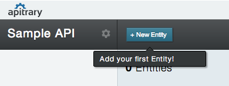
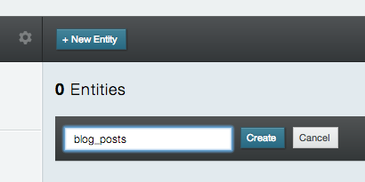
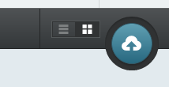
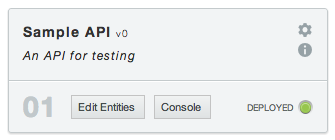

# Getting started

This is the getting started guide which will lead you through easy steps in order to successfully deploy your apitrary backend.

For this guide you should already have successfully signed up for apitrary. If not, please make sure to [sign up now](http://launchpad.apitrary.com/ "Sign up for apitrary") in order to continue with the guide.

You can quickly sign up on [Launchpad](http://launchpad.apitrary.com/ "Launchpad").

## RESTful API as your backend

apitrary will generate backends for your applications in very easy steps. A backend  consists of a generated REST API with a set of REST endpoints. All endpoints use [https://api.apitrary.com/](https://api.apitrary.com/ "API endpoint URL") as base URL.

Following will give you a brief overview of the provided endpoints:

<table>
	<tr>
		<th>Endpoint</th>
		<th>Verbs</th>
		<th>Comment</th>
	</tr>
	<tr>
		<td><a href="#get_single_object" alt="Single Object GET">/:entity_name/:object_id</a></td>
		<td>GET</td>
		<td>Retrieve single object</td>
	</tr>
	<tr>
		<td><a href="#post_single_object" alt="Single Object POST">/:entity_name</a></td>
		<td>POST</td>
		<td>Store a single object</td>
	</tr>
	<tr>
		<td><a href="#update_single_object" alt="Single Object PUT">/:entity_name/:object_id</a></td>
		<td>PUT</td>
		<td>Update single object</td>
	</tr>
	<tr>
		<td><a href="#delete_single_object" alt="Single Object DELETE">/:entity_name/:object_id</a></td>
		<td>DELETE</td>
		<td>Delete single object</td>
	</tr>
	<tr>
		<td><a href="#get_single_object" alt="Single Object GET">/:entity_name/:object_id</a></td>
		<td>GET</td>
		<td>Retrieve single object</td>
	</tr>
	<tr>
		<td><a href="#search_for_objects" alt="Search objects">/:entity_name?q=:search_expression</a></td>
		<td>GET</td>
		<td>Search for objects</td>
	</tr>
</table>

For more information on the relevant endpoints, read the [REST Guide](../RESTGuide.html "apitrary REST Guide").

## Creating APIs

Once you have [signed up](https://launchpad.apitrary.com "Launchpad"), simply login into [Launchpad](https://launchpad.apitrary.com "Launchpad"). On your first login, you will not have an API, yet. Click the *Create API* button to start creating your first API.

You should now see the API Create box:

Fill in the name of your API and, optionally, a short description. Finish by clicking *Create API*. You should now see a new API:

You have successfully created your first API. Now continue to edit your API by adding entities.

## Adding entities

Adding entities to your API is just as easy. Click the *Edit Entities* which will bring you to **Kolay**, our API editor.

Click *New Entity* to create your first entity and add a descriptive name.

**Please note:** Entity names should be **lower-case**!

Add more entities as you need!

In case your plan does not provide the number of entities you require, add more entities through our add-ons.

**BETA NOTICE!** Due to our current *Beta stadium*, we still have a few limitations:

- add-ons are still not available *(coming in the near future)*
- entities cannot be deleted after deployment *(coming soon)*
- functionality to add *attributes* to entities is not yet provided *(coming soon)*

**Great!** You are just about to deploy your first API!

## Deploying an API

Once you are finished with adding entities, click the *Deploy* button:

You can now return back to *Launchpad* and should see the current state of your API:

Your API will now be in state *Deployed*.

Deployed APIs have a new *Console* button to reach the REST Console. More information about the *Console* can be found in the [Console Guide](../ConsoleGuide.html).

**BETA NOTICE!** Due to our current *Beta stadium*, we still have a few limitations:

- Undeploying an API is currently not available *(coming in the near future)*

**Congratulations! You have your first running API!**

## Further readings

There is more to read:

- [REST Guide](../RESTGuide.html)
- [Search Guide](../SearchGuide.html)
- [Console Guide](../ConsoleGuide.html)
