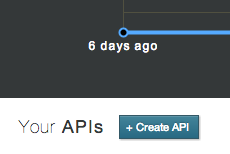
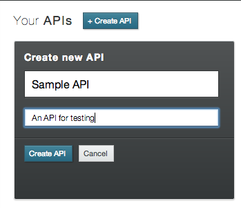
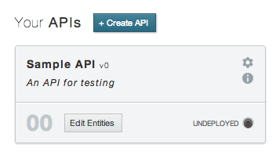

# Getting started

This is the getting started guide which will lead you through easy steps in order to successfully deploy your apitrary backend.

For this guide you should already have successfully signed up for apitrary. If not, please make sure to [sign up now](http://launchpad.apitrary.com/ "Sign up for apitrary") in order to continue with the guide.

You can quickly sign up on [Launchpad](http://launchpad.apitrary.com/ "Launchpad").

## RESTful API as your backend

apitrary will generate backends for your applications in very easy steps. A backend  consists of a generated REST API with a set of REST endpoints. All endpoints use [https://api.apitrary.com/](https://api.apitrary.com/ "API endpoint URL") as base URL.

Following will give you a brief overview of the provided endpoints:

<table>
	<tr>
		<th>Endpoint</th>
		<th>Verbs</th>
		<th>Comment</th>
	</tr>
	<tr>
		<td><a href="#get_single_object" alt="Single Object GET">/:entity_name/:object_id</a></td>
		<td>GET</td>
		<td>Retrieve single object</td>
	</tr>
	<tr>
		<td><a href="#post_single_object" alt="Single Object POST">/:entity_name</a></td>
		<td>POST</td>
		<td>Store a single object</td>
	</tr>
	<tr>
		<td><a href="#update_single_object" alt="Single Object PUT">/:entity_name/:object_id</a></td>
		<td>PUT</td>
		<td>Update single object</td>
	</tr>
	<tr>
		<td><a href="#delete_single_object" alt="Single Object DELETE">/:entity_name/:object_id</a></td>
		<td>DELETE</td>
		<td>Delete single object</td>
	</tr>
	<tr>
		<td><a href="#get_single_object" alt="Single Object GET">/:entity_name/:object_id</a></td>
		<td>GET</td>
		<td>Retrieve single object</td>
	</tr>
	<tr>
		<td><a href="#search_for_objects" alt="Search objects">/:entity_name?q=:search_expression</a></td>
		<td>GET</td>
		<td>Search for objects</td>
	</tr>
</table>

For more information on the relevant endpoints, read the [REST Guide](../RESTGuide.html "apitrary REST Guide").

## Creating APIs

Once you have [signed up](https://launchpad.apitrary.com "Launchpad"), simply login into [Launchpad](https://launchpad.apitrary.com "Launchpad"). On your first login, you will not have an API, yet. Click the *Create API* button to start creating your first API.

You should now see the API Create box:

Fill in the name of your API and, optionally, a short description. Finish by clicking "Create API". You should now see a new API:

You have successfully created your first API. Now continue to edit your API by adding entities.

## Adding entities

Talk about how to create entities. Tell the reader that entities can only be created and not deleted for now. Tell the reader that undeploying an API to change entities is coming soon.

## Deploying an API

Tell the user how to deploy an API. Tell him/her to get back to Launchpad admin to check for deployment status. Tell the reader that undeploying is a feature coming soon.

## Further readings

Tell the reader how to continue from here:
- REST Guide
- Search Guide

